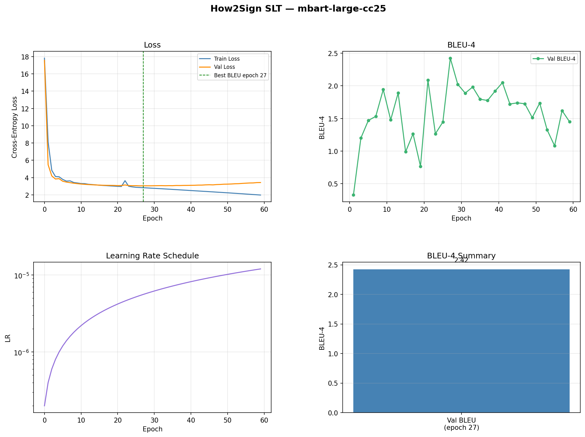

# American Sign Language (ASL) Recognition & Translation

This project is part of UST Vision AI SEIS766.

---

## Datasets

| Dataset | Task | Source |
|---|---|---|
| WLASL | Word-level recognition | [Kaggle](https://www.kaggle.com/datasets/risangbaskoro/wlasl-processed) (accessed 4/15/2026) |
| ASL-Citizen | Word-level recognition | [Kaggle](https://www.kaggle.com/datasets/abd0kamel/asl-citizen) (accessed 4/21/2026) |
| How2Sign | Sentence-level translation | [how2sign.github.io](https://how2sign.github.io/) (accessed 4/25/2026) |

---

## Architecture


---

## Repo Structure

```
word/
  train.py              — train word-level classifier
  evaluate.py           — top-1 / top-5 accuracy on any split
  demo.py               — single-video inference with overlay
  save_results.py       — generate training plots and summary
  configs/              — YAML configs for each dataset/scale
  scripts/
    download_data.py    — download WLASL or ASL-Citizen from Kaggle
  src/
    dataset.py          — ASLCitizenDataset, WLASLDataset, read_video_clip
    model.py            — R(2+1)D-18 classifier wrapper
    utils.py            — accuracy, cosine LR schedule, checkpoint helpers

sentence/
  train.py              — train Keypoint Transformer + mBART
  evaluate.py           — BLEU-4 on any split
  demo.py               — text predictions on random/named test samples
  demo_gif.py           — animated GIF: video + word-by-word translation
  save_results.py       — generate training plots and summary
  configs/
    config_how2sign.yaml
  scripts/
    preprocess_keypoints.py  — OpenPose JSON -> .npy (run once)
  src/
    dataset.py          — How2SignDataset, H2SCollator
    model.py            — KeypointEncoder, SignTranslationModel, build_model
    utils.py            — compute_bleu, checkpoint helpers

assets/                 — diagrams and demo GIFs
checkpoints/            — saved model weights
results/                — training plots and summaries
```

---

## Setup

### Create and activate conda environment
```bash
conda create -p ./env python=3.11 -y
conda activate ./env
```

### Install PyTorch with CUDA 12.6
```bash
pip install torch torchvision --index-url https://download.pytorch.org/whl/cu126
```

### Install remaining dependencies
```bash
pip install -r requirements.txt
```

---

## Word-Level Recognition (R(2+1)D-18)

Classifies short video clips into individual ASL word labels.

### Download dataset
```bash
env/python.exe word/scripts/download_data.py --dataset wlasl        # WLASL
env/python.exe word/scripts/download_data.py --dataset aslcitizen   # ASL-Citizen
```

### Train
```bash
env/python.exe word/train.py --config word/configs/config_aslcitizen_full.yaml
```

### Resume from checkpoint
```bash
env/python.exe word/train.py --config word/configs/config_aslcitizen_full.yaml --resume checkpoints/aslcitizen_full/last.pth
```

### Evaluate
```bash
env/python.exe word/evaluate.py --config word/configs/config_aslcitizen_full.yaml --split test
```

### Save results (plots + summary)
```bash
env/python.exe word/save_results.py --config word/configs/config_aslcitizen_full.yaml
```

### Run demo on a video
```bash
env/python.exe word/demo.py --checkpoint checkpoints/aslcitizen_full/best.pth --video <video.mp4>
```

---

## Sentence-Level Translation (Keypoint Transformer + mBART)

Translates continuous ASL signing (2D keypoints) into English sentences.

**Model**: OpenPose 201-dim keypoints → 4-layer Transformer encoder (d=512) → mBART-large-cc25 decoder.

### Preprocess keypoints (run once)
```bash
env/python.exe sentence/scripts/preprocess_keypoints.py --data_root data/how2sign
```

### Train
```bash
env/python.exe sentence/train.py --config sentence/configs/config_how2sign.yaml
```

### Resume from checkpoint
```bash
env/python.exe sentence/train.py --config sentence/configs/config_how2sign.yaml --resume checkpoints/how2sign/last.pth
```

### Evaluate (BLEU-4)
```bash
env/python.exe sentence/evaluate.py --config sentence/configs/config_how2sign.yaml --split test
```

### Save results (plots + summary)
```bash
env/python.exe sentence/save_results.py --config sentence/configs/config_how2sign.yaml
```

### Run text demo (random test samples)
```bash
env/python.exe sentence/demo.py --config sentence/configs/config_how2sign.yaml --n 10
env/python.exe sentence/demo.py --config sentence/configs/config_how2sign.yaml --sentence "g3X3XE6M2_A_20-3-rgb_front"
```

### Generate animated GIF demo
```bash
env/python.exe sentence/demo_gif.py --config sentence/configs/config_how2sign.yaml
env/python.exe sentence/demo_gif.py --config sentence/configs/config_how2sign.yaml --n 3 --out results/demos
```

---

## Results

### Word-Level — ASL-Citizen (100 classes)


### Sentence-Level — How2Sign

Trained on 31K samples, 60 epochs (~5h 50m on a single GPU).

| Metric | Value |
|---|---|
| Best Val BLEU-4 | **2.42** (epoch 27) |
| Final train loss | 1.99 |
| Final val loss | 3.43 |



---

## Word-Level Demo

| APPLE | ANYONE | ADVERTISE |
|:---:|:---:|:---:|
|  |  |  |
