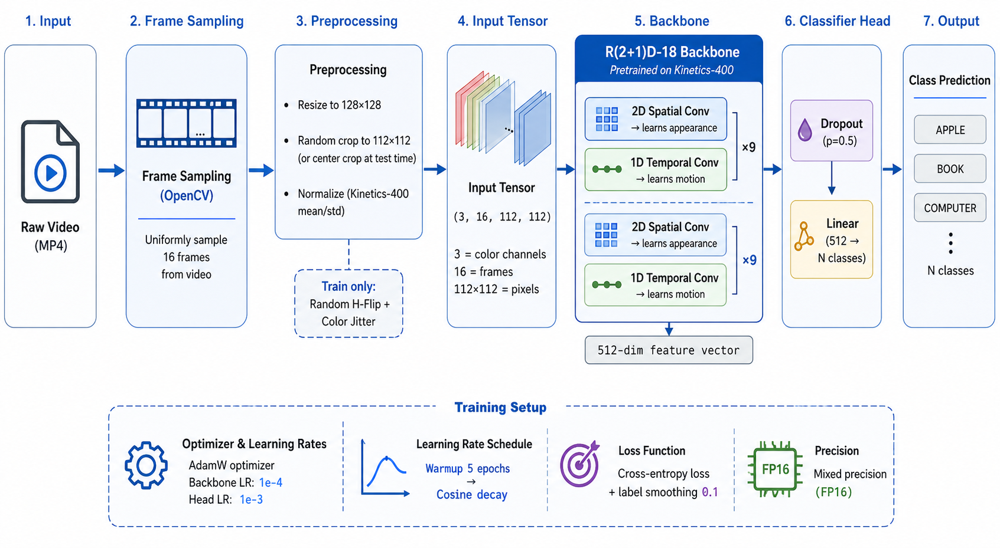
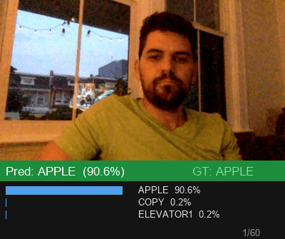
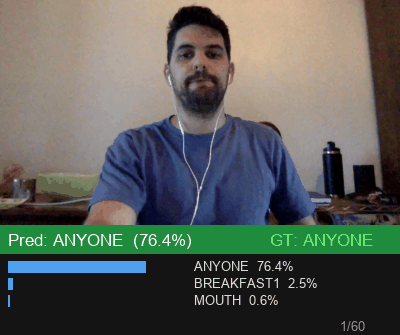
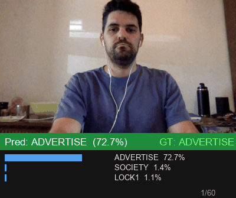

# American Sign Language (ASL) Recognition

This project to be as part of UST Vision AI SEIS766.

---
## Dataset
- Dataset used can be found on: 
    - WLASL: https://www.kaggle.com/datasets/risangbaskoro/wlasl-processed (last access 4/15/2026).
    - ASL-Citizen: https://www.kaggle.com/datasets/abd0kamel/asl-citizen (last access 4/21/2026)
    - How2Sign: https://how2sign.github.io/ (last access 4/25/2026)
---
## Achitecture

---
## Usage

### Create and activate conda environment
```bash
  conda create -p ./env python=3.10 -y
  conda activate ./env
```
### Install PyTorch with CUDA 12.6
```bash
  pip install torch torchvision --index-url https://download.pytorch.org/whl/cu126
```
### Install remaining dependencies
```bash
  pip install -r requirements.txt
```
### Download dataset
```bash
env/python.exe scripts/download_data.py --dataset <choose a dataset>
```
### Train
```bash
env/python.exe train.py --config configs/<choose a config file>
```
### Resume from checkpoint
```bash
env/python.exe train.py --config <choose a config file> --resume checkpoints/<choose a checkpoint>
```
### Save Results (plots + summary)
```bash
env/python.exe save_results.py --config configs/<choose a config file>
```
---
## Results


---
## Demo

Run inference on any video file and save an annotated GIF:

```bash
env/python.exe demo.py --checkpoint checkpoints/aslcitizen_full/best.pth --video path/to/video.mp4
```

| APPLE (90.6%) | ANYONE (76.4%) | ADVERTISE (72.7%) |
|:---:|:---:|:---:|
|  |  |  |
