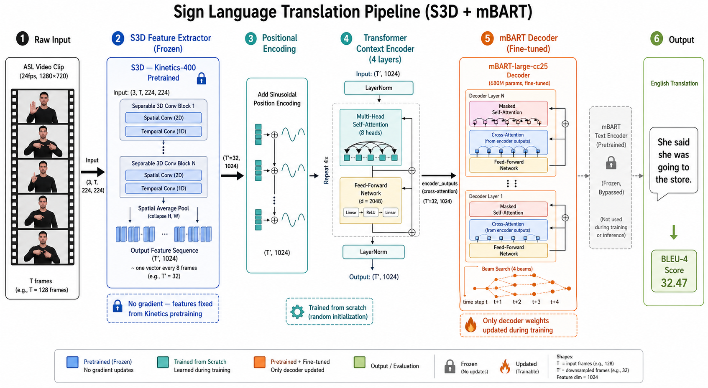
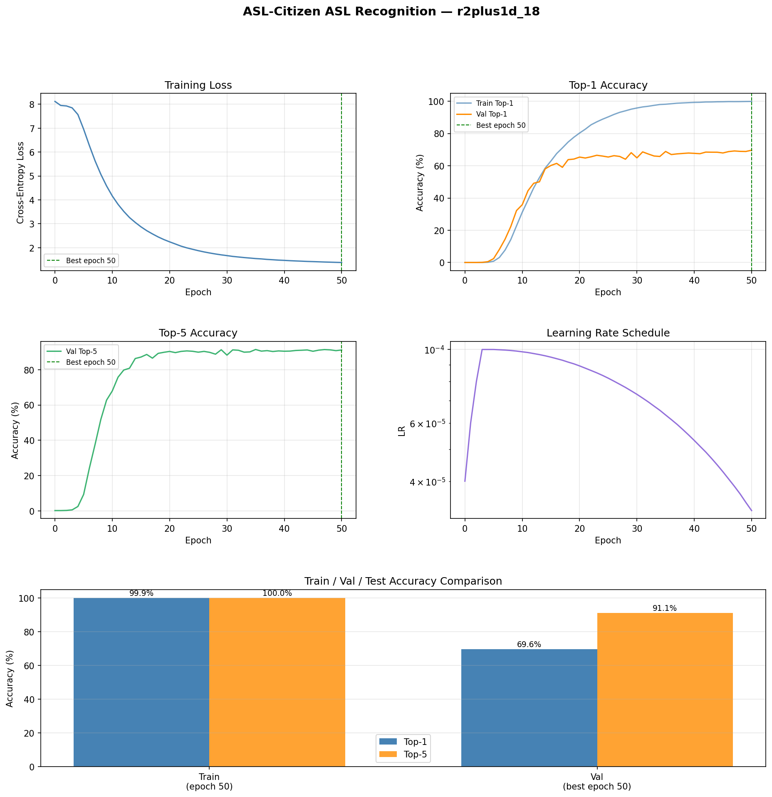
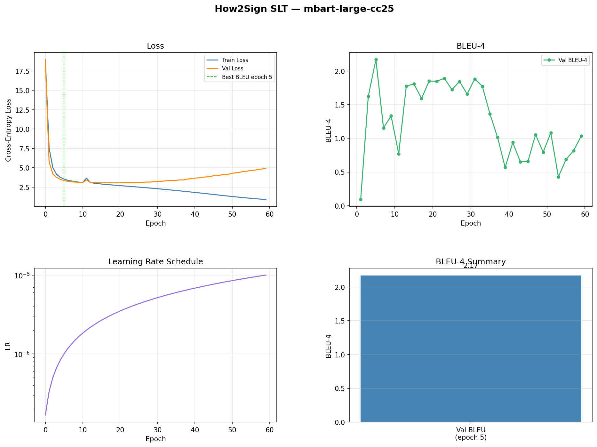
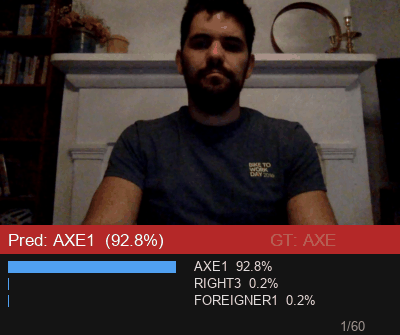
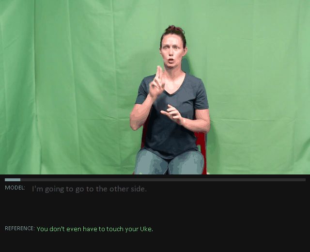
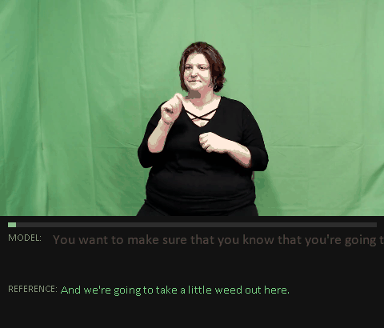

# American Sign Language (ASL) Recognition & Translation

This project is part of UST Vision AI SEIS766. It implements two complementary systems:

- **Word-level recognition** — classify short clips into individual ASL sign labels (R(2+1)D-18)
- **Sentence-level translation** — translate continuous ASL signing into English text (Keypoint Transformer + mBART)

---

## Datasets

| Dataset | Task | Classes | Samples | Source |
|---|---|---|---|---|
| WLASL | Word recognition | up to 2000 | ~21K clips | [Kaggle](https://www.kaggle.com/datasets/risangbaskoro/wlasl-processed) (accessed 4/15/2026) |
| ASL-Citizen | Word recognition | 2731 | ~83K clips | [Kaggle](https://www.kaggle.com/datasets/abd0kamel/asl-citizen) (accessed 4/21/2026) |
| How2Sign | Sentence translation | — | ~31K sentences | [how2sign.github.io](https://how2sign.github.io/) (accessed 4/25/2026) |

---

## Architecture

### Word-Level — R(2+1)D-18


Video clips (16 frames, 112×112) are passed through a **R(2+1)D-18** backbone pretrained on Kinetics-400. The final feature vector (2048-dim) is fed through dropout and a linear head. The backbone and head use differential learning rates (10× higher for the head).

### Sentence-Level — Keypoint Transformer + mBART



OpenPose 2D keypoints (25 pose + 21 left hand + 21 right hand = **201 dims**) are extracted per frame and resampled to 128 frames. A **4-layer Transformer encoder** (d=512, 8 heads) projects them into a 1024-dim visual sequence, which is fed into the cross-attention layers of a frozen **mBART-large-cc25** decoder. Only the encoder and decoder cross-attention are trained; the mBART text encoder remains frozen.

---

## Repo Structure

```
word/
  train.py              — train word-level classifier
  evaluate.py           — top-1 / top-5 accuracy on any split
  demo.py               — single-video inference with overlay
  save_results.py       — generate training plots and summary
  configs/              — YAML configs for each dataset/scale
  scripts/
    download_data.py    — download WLASL or ASL-Citizen from Kaggle
  src/
    dataset.py          — ASLCitizenDataset, WLASLDataset, read_video_clip
    model.py            — R(2+1)D-18 classifier wrapper
    utils.py            — accuracy, cosine LR schedule, checkpoint helpers

sentence/
  train.py              — train Keypoint Transformer + mBART
  evaluate.py           — BLEU-4 on any split
  demo.py               — text predictions on random/named test samples
  demo_gif.py           — animated GIF: video + word-by-word translation
  save_results.py       — generate training plots and summary
  configs/
    config_how2sign.yaml
    config_how2sign_s3d.yaml
  scripts/
    preprocess_keypoints.py  — OpenPose JSON -> .npy (run once)
    extract_s3d_features.py  — extract S3D features (S3D variant)
  src/
    dataset.py          — How2SignDataset, How2SignS3DDataset, H2SCollator
    model.py            — KeypointEncoder, SignTranslationModel, build_model
    utils.py            — compute_bleu, checkpoint helpers

assets/                 — diagrams and demo GIFs
checkpoints/            — saved model weights
results/                — training plots and summaries
```

---

## Setup

### Create and activate conda environment
```bash
conda create -p ./env python=3.11 -y
conda activate ./env
```

### Install PyTorch with CUDA 12.6
```bash
pip install torch torchvision --index-url https://download.pytorch.org/whl/cu126
```

### Install remaining dependencies
```bash
pip install -r requirements.txt
```

---

## Word-Level Recognition (R(2+1)D-18)

Classifies short video clips into individual ASL word labels.

### Download dataset
```bash
env/python.exe word/scripts/download_data.py --dataset wlasl        # WLASL
env/python.exe word/scripts/download_data.py --dataset aslcitizen   # ASL-Citizen
```

### Train
```bash
env/python.exe word/train.py --config word/configs/config_aslcitizen_full.yaml
```

### Resume from checkpoint
```bash
env/python.exe word/train.py --config word/configs/config_aslcitizen_full.yaml --resume checkpoints/aslcitizen_full/last.pth
```

### Evaluate
```bash
env/python.exe word/evaluate.py --config word/configs/config_aslcitizen_full.yaml --split test
```

### Save results (plots + summary)
```bash
env/python.exe word/save_results.py --config word/configs/config_aslcitizen_full.yaml
```

### Run demo on a video
```bash
env/python.exe word/demo.py --checkpoint checkpoints/aslcitizen_full/best.pth --video <video.mp4>
```

---

## Sentence-Level Translation (Keypoint Transformer + mBART)

Translates continuous ASL signing (2D keypoints) into English sentences.

**Model**: OpenPose 201-dim keypoints → 4-layer Transformer encoder (d=512) → mBART-large-cc25 decoder.

### Preprocess keypoints (run once)
```bash
env/python.exe sentence/scripts/preprocess_keypoints.py --data_root data/how2sign
```

### Train
```bash
env/python.exe sentence/train.py --config sentence/configs/config_how2sign.yaml
```

### Resume from checkpoint
```bash
env/python.exe sentence/train.py --config sentence/configs/config_how2sign.yaml --resume checkpoints/how2sign/last.pth
```

### Evaluate (BLEU-4)
```bash
env/python.exe sentence/evaluate.py --config sentence/configs/config_how2sign.yaml --split test
```

### Save results (plots + summary)
```bash
env/python.exe sentence/save_results.py --config sentence/configs/config_how2sign.yaml
```

### Run text demo (random test samples)
```bash
env/python.exe sentence/demo.py --config sentence/configs/config_how2sign.yaml --n 10
env/python.exe sentence/demo.py --config sentence/configs/config_how2sign.yaml --sentence "g3X3XE6M2_A_20-3-rgb_front"
```

### Generate animated GIF demo
```bash
env/python.exe sentence/demo_gif.py --config sentence/configs/config_how2sign.yaml
env/python.exe sentence/demo_gif.py --config sentence/configs/config_how2sign.yaml --n 3 --out results/demos
```

---

## Results

### Word-Level

| Dataset | Classes | Val Top-1 | Val Top-5 | Test Top-1 | Test Top-5 | Training Time |
|---|---|---|---|---|---|---|
| ASL-Citizen-100 | 100 | **88.12%** | **97.10%** | **84.52%** | **95.98%** | 1h 55m |
| ASL-Citizen-Full | 2731 | 69.62% | 91.14% | — | — | 27h 1m |
| WLASL-100 | 100 | 55.15% | 83.64% | 41.00% | 78.00% | 59m |
| WLASL-2000 | 2000 | 7.41% | 25.03% | 6.29% | 23.41% | 9h 15m |

All models: R(2+1)D-18, 16 frames, 112×112, pretrained Kinetics-400, AdamW + cosine schedule.

| ASL-Citizen-100 | ASL-Citizen-Full |
|:---:|:---:|
|  |  |

| WLASL-100 | WLASL-2000 |
|:---:|:---:|
|  |  |

### Sentence-Level — How2Sign

Both variants trained on 31K samples for 60 epochs.

| Model | Encoder Input | Frames | Val BLEU-4 | Training Time |
|---|---|---|---|---|
| Keypoint + mBART | 201-dim OpenPose keypoints | 128 | **2.42** (epoch 27) | 5h 51m |
| S3D + mBART | 1024-dim S3D features | 32 | 2.17 (epoch 5) | 5h 59m |

| Keypoint + mBART | S3D + mBART |
|:---:|:---:|
|  |  |

---

## Word-Level Demo

Inference on individual ASL sign videos. Each frame shows top predicted labels and confidence bars.

| APPLE | ANYONE | ADVERTISE | AXE |
|:---:|:---:|:---:|:---:|
|  |  |  |  |

---

## Sentence-Level Demo

Each clip shows the reference English sentence (green) and the model's predicted translation (white, revealed word-by-word).

| | |
|:---:|:---:|
|  |  |
|  |  |
